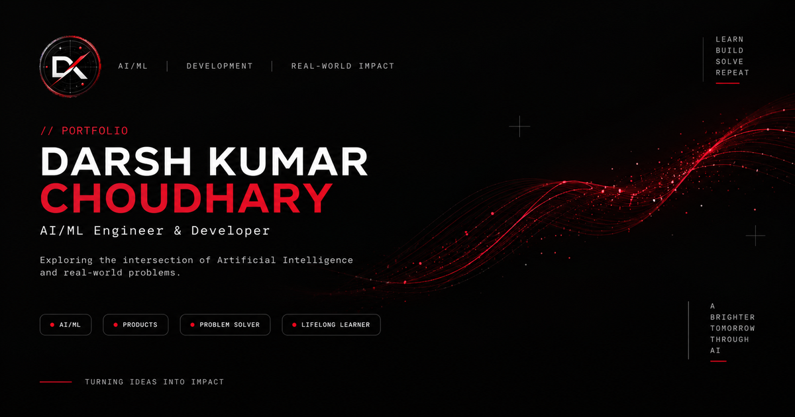

[README.md](https://github.com/user-attachments/files/31885109/README.md)
<div align="center">

  

  # Darsh Kumar Choudhary
  ### AI/ML Engineering Student & Developer Portfolio

  <p align="center">
    A high-performance, cinematic personal portfolio crafted with pure vanilla HTML5, CSS3, and JavaScript — zero frameworks, zero external runtime dependencies.
  </p>

  <p align="center">
    <a href="https://darshkumar07.github.io/darsh-portfolio/">
      
    </a>
    
    
    
  </p>

  <p align="center">
    <a href="#-overview">Overview</a> •
    <a href="#-key-features">Key Features</a> •
    <a href="#-tech-stack--architecture">Tech Stack</a> •
    <a href="#-project-structure">Structure</a> •
    <a href="#-local-development">Local Setup</a> •
    <a href="#-contact">Contact</a>
  </p>

  

</div>

---

## ✦ Overview

This repository hosts the source code for my personal developer portfolio, accessible live at **[darshkumar07.github.io/darsh-portfolio](https://darshkumar07.github.io/darsh-portfolio/)**.

Built around a minimalist dark aesthetic (`#08090B`) with neon crimson accents (`#E43B3B`), the site showcases my projects, engineering background, and journey as a 2nd-year AI/ML student at CMR Institute of Technology, Bengaluru.

Every interaction, physics simulation, and visual effect is engineered from scratch using native Web APIs to achieve instantaneous load times, 60/120 FPS render loops, and strict WCAG accessibility compliance.

---

## ✦ Key Features

### 🌌 Cinematic Gravitational Starfield Intro
- **Canvas Particle Engine**: 3D perspective starfield with dynamic forward warp acceleration.
- **Singularity Event Horizon**: Stars dynamically gravitationally collapse into the navbar logo coordinates using ease-in radial pull.
- **FLIP Flight Animation**: First-Last-Invert-Play coordinate mapping smoothly transitions the centered intro badge directly into the persistent sticky navigation bar.
- **Triple-Layer No-JS & Crash Fallback**: Immediate `<noscript>` and `html.no-js` fallback styles ensure the site renders seamlessly even if JavaScript is disabled or fails to execute.

### 🎛️ Interactive 3D Parallax Hero Stage
- **Mouse & Gyroscope 3D Tilt**: Real-time perspective transformation (`rotateX` / `rotateY`) applied to the photo card and futuristic HUD brackets.
- **Telemetry HUD Overlays**: Sci-fi matrix diagnostics, coordinates (`12.9716° N, 77.5946° E`), and scanning grid backdrop.
- **Adaptive Frame Rate**: Decoupled render loop maintains silky smooth easing across both 60 Hz and high-refresh 120/144 Hz displays without double-taxing GPU resources.

### 🌊 Flowing Multi-Ribbon Data Wave
- **Interactive Sine Wave Simulation**: Multi-layered particle ribbons modulated by cursor proximity and scrolling velocity.
- **Turbulence Physics**: Exponential drag decay ensures kinetic energy smoothly subsides when scrolling halts.
- **Adaptive Canvas Resolution**: Backing-store resolution dynamically scales with device pixel ratio (`DPR`), optimizing rendering efficiency for high-DPI retina displays.

### ♿ Accessibility & Performance First
- **Semantic HTML5 Landmark Hierarchy**: Screen reader-friendly document structure with logical `<main>`, `<header>`, `<nav>`, `<section>`, and heading sequences (`h1` -> `h2` -> `h3`).
- **Focus Management & Trapping**: Mobile navigation drawer cleanly traps `Tab` navigation and restores focus to the toggle button upon dismissal.
- **Reduced Motion Support**: Fully respects `prefers-reduced-motion: reduce`, replacing physics loops with clean static states.
- **Hardened Content Security Policy**: Strict CSP meta policy forbidding unauthorized script sources, framing, and external network connections.

---

## ✦ Tech Stack & Architecture

| Layer | Technology | Purpose |
| :--- | :--- | :--- |
| **Markup** | HTML5 Semantic Elements | Structural semantic landmarks, `<main id="main">`, ARIA state attributes |
| **Styles** | Vanilla CSS3 (Custom Properties) | Modular theme variables, CSS Grid, Flexbox, GPU `transform3d` animations |
| **Graphics** | HTML5 Canvas API (2D Context) | Hardware-accelerated starfield singularity and data wave simulations |
| **Scripting** | Vanilla ES6+ JavaScript | Zero build step, zero bundlers, pure native browser APIs |
| **Typography**| Google Fonts | `Sora` (Headings), `Manrope` (Body), `IBM Plex Mono` (Technical labels) |
| **Hosting** | GitHub Pages | Fast, reliable static hosting with automated git push deploys |

---

## ✦ Project Structure

```text
darsh-portfolio/
├── index.html              # Core single-page application (Markup, Styles & Scripts)
├── logo.webp               # Scalable brand vector / WebP emblem
├── profile.webp            # High-resolution hero portrait (defringed matte)
├── flexiheal-icon.webp     # Project app icon for FlexiHeal
├── social-preview.png      # Open Graph / Twitter Card social banner (1200x630)
├── favicon.ico             # Legacy browser icon
├── favicon-16.png          # Standard 16x16 favicon
├── favicon-32.png          # Standard 32x32 favicon
├── favicon-48.png          # Standard 48x48 favicon
├── apple-touch-icon.png    # iOS home screen web-clip icon (180x180)
└── README.md               # Repository documentation
```

---

## ✦ Featured Project: FlexiHeal

**FlexiHeal** is an AI-powered tele-rehabilitation platform designed for patients recovering from surgery or musculoskeletal injuries.

- **AI Virtual Guidance**: Day-to-day rehabilitation routines and posture correction.
- **Computer Vision Analysis**: Movement and biomechanical feedback from exercise video inputs.
- **Wearable Vitals Integration**: Real-time heart rate and physiological tracking during rehab sessions.
- **Stack**: Flutter, AI/ML, Wearable Integration, Cloud Data, REST APIs.
- **Repository**: [github.com/DarshKumar07/FlexiHeal](https://github.com/DarshKumar07/FlexiHeal)

---

## ✦ Local Development

Because this project is built with zero dependencies and no build step, you can run and preview it locally with any standard HTTP server:

### Option 1: Python (Recommended)
```bash
# Clone the repository
git clone https://github.com/darshkumar07/darsh-portfolio.git
cd darsh-portfolio

# Start a local HTTP server
python -m http.server 8000
```
Open [http://localhost:8000](http://localhost:8000) in your browser.

### Option 2: Node.js / npx
```bash
npx serve .
```

### Option 3: VS Code Live Server
Right-click `index.html` in VS Code and select **"Open with Live Server"**.

---

## ✦ Deployment

This project is deployed to **GitHub Pages** directly from the `main` branch:

1. Push changes to the repository:
   ```bash
   git add .
   git commit -m "Update portfolio features"
   git push origin main
   ```
2. In GitHub, navigate to **Settings** > **Pages**.
3. Under **Build and deployment**, select **Deploy from a branch**, and set the branch to `main` / `(root)`.

---

## ✦ Contact & Connect

- **Portfolio**: [darshkumar07.github.io/darsh-portfolio](https://darshkumar07.github.io/darsh-portfolio/)
- **LinkedIn**: [linkedin.com/in/darsh-kumar-choudhary-835374420](https://www.linkedin.com/in/darsh-kumar-choudhary-835374420/)
- **Email**: [darsh.aiml25@cmrit.ac.in](mailto:darsh.aiml25@cmrit.ac.in)
- **GitHub**: [@darshkumar07](https://github.com/darshkumar07)

---

<div align="center">
  <sub>Designed & Developed by Darsh Kumar Choudhary © 2026. All rights reserved.</sub>
</div>
